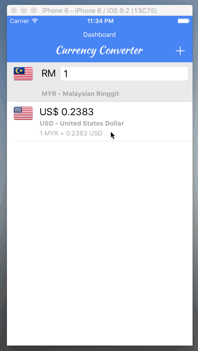

# Currency-Converter
Basic currency converter app that written in swift.

## Features

* Convert every world currency with live currency rates that obtain from currencylayer API. 
* It can monitor as many currencies as you want at the same time by specifying a base currency. 
* Beautiful flags are shown for every currency.

## Preview

## Library

* Alamofire
* Gloss
* FlagKit

## Json
[World Currency](https://github.com/DavidODW/world-currencies)